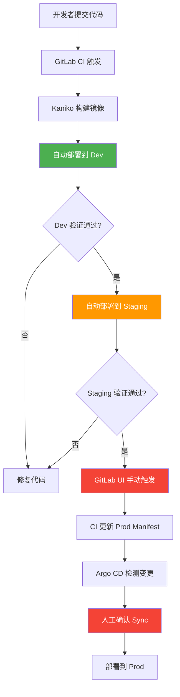

# Stage 2: 多环境发布（dev / staging / prod）

## 流程概览



## Kustomize Overlay 架构

```
stage2-multi-env/k8s/
├── base/                      ← 共享基础配置
│   ├── deployment.yaml
│   ├── service.yaml
│   └── kustomization.yaml
└── overlays/
    ├── dev/                   ← 开发环境覆盖
    │   └── kustomization.yaml (1 replica, low resources)
    ├── staging/               ← 预发布环境覆盖
    │   └── kustomization.yaml (2 replicas, standard resources)
    └── prod/                  ← 生产环境覆盖
        └── kustomization.yaml (3 replicas, high resources)
```

---

## 一、前置条件

| 项目 | 要求 | 说明 |
|------|------|------|
| Stage 1 完成 | 已成功部署 | Stage 2 在 Stage 1 基础上扩展 |
| Kind 集群 | 运行中 | `kubectl get nodes` |
| Argo CD | 已安装 | `kubectl get pods -n argocd` |
| GitLab 项目 | `cicd-demo` 已创建 | Stage 1 已推送 |

---

## 二、操作步骤

### Step 1: 理解分支策略

```
main ──────────────────────────────────── 生产就绪代码
  │
  └── develop ─────────────────────────── 开发集成分支
        │
        ├── feature/xxx ───────────────── 功能分支
        └── hotfix/xxx ────────────────── 紧急修复

合并规则:
  feature → develop: 自动触发 dev 部署
  develop → main:    自动触发 staging 部署
  main → prod:       需要手动触发（when: manual）
```

### Step 2: 推送 Stage 2 代码

```bash
cd /path/to/cicd-demo

# 复制 stage2 目录
cp -r /path/to/cicd_easy/stage2-multi-env/ .

# 创建 develop 分支
git checkout -b develop

# 推送到 GitLab
git add .
git commit -m "feat: add stage2 multi-environment deploy"
git push origin develop

# 合并到 main 触发 staging 部署
git checkout main
git merge develop
git push origin main
```

### Step 3: 创建 Argo CD Applications

```bash
# 为三个环境分别创建 Application
kubectl apply -f stage2-multi-env/k8s/argocd-apps/dev.yaml
kubectl apply -f stage2-multi-env/k8s/argocd-apps/staging.yaml
kubectl apply -f stage2-multi-env/k8s/argocd-apps/prod.yaml

# 验证
argocd app list | grep stage2
# 预期: 3 个 Application（dev/staging/prod）
```

### Step 4: 观察自动部署到 Dev 和 Staging

```bash
# dev 和 staging 会自动部署（Auto Sync）
# 检查 dev 环境
kubectl get pods -n dev -l app=stage2-app
# 预期: 1 个 Running Pod

# 检查 staging 环境
kubectl get pods -n staging -l app=stage2-app
# 预期: 2 个 Running Pod
```

### Step 5: 手动触发 Prod 部署

```bash
# 方式 1: 在 GitLab UI 手动触发 CI Job
# 1. 打开 GitLab → CI/CD → Pipelines
# 2. 找到最新的 pipeline
# 3. 点击 deploy:prod job 旁边的 ▶ 按钮手动触发

# 方式 2: 触发后观察 Argo CD
# CI 更新 prod overlay 后，Argo CD 显示 Out of Sync
argocd app get stage2-prod
# 状态: Out of Sync（因为 prod 使用 Manual Sync）

# 在 Argo CD Dashboard 手动点击 Sync
# 或使用 CLI:
argocd app sync stage2-prod
```

### Step 6: 验证环境差异

```bash
# 验证各环境副本数和资源限制
echo "=== Dev ==="
kubectl get deployment -n dev -o wide
echo "=== Staging ==="
kubectl get deployment -n staging -o wide
echo "=== Prod ==="
kubectl get deployment -n prod -o wide

# 验证命名空间隔离
kubectl get namespaces | grep -E 'dev|staging|prod'
```

---

## 三、预期结果

| 检查项 | Dev | Staging | Prod |
|--------|-----|---------|------|
| 同步策略 | Auto Sync | Auto Sync | Manual Sync |
| 副本数 | 1 | 2 | 3 |
| 资源限制 | 100m/64Mi | 200m/128Mi | 500m/256Mi |
| Argo CD 状态 | Synced | Synced | Out of Sync（直到手动 Sync） |
| 部署触发 | git push 自动 | git push 自动 | CI 手动点击 + Argo Sync |

---

## 四、验证命令

```bash
# 1. 检查所有环境的 Application
argocd app list | grep stage2

# 2. 检查各环境 Pod
kubectl get pods -n dev -l app=stage2-app
kubectl get pods -n staging -l app=stage2-app
kubectl get pods -n prod -l app=stage2-app

# 3. 验证 Kustomize 渲染结果
kubectl kustomize stage2-multi-env/k8s/overlays/dev
kubectl kustomize stage2-multi-env/k8s/overlays/staging
kubectl kustomize stage2-multi-env/k8s/overlays/prod

# 4. Port-Forward 访问各环境
kubectl port-forward -n dev svc/stage2-svc-dev 8081:80 &
kubectl port-forward -n staging svc/stage2-svc-staging 8082:80 &
kubectl port-forward -n prod svc/stage2-svc-prod 8083:80 &

# 5. 验证环境标签
kubectl get deployment -n dev stage2-app-dev -o jsonpath='{.metadata.labels}'
kubectl get deployment -n staging stage2-app-staging -o jsonpath='{.metadata.labels}'
kubectl get deployment -n prod stage2-app-prod -o jsonpath='{.metadata.labels}'

# 6. 验证 prod 手动门控
# 修改代码并推送 → 观察 CI Pipeline
# deploy:prod job 应显示 "manual" 标签，需要手动点击
```

---

## 常见问题排查

| 问题 | 原因 | 解决方法 |
|------|------|----------|
| Kustomize 构建失败 | base 引用路径错误 | 检查 `resources:` 路径是否正确 |
| Argo CD 找不到资源 | path 配置错误 | 确认 Application 的 `source.path` |
| prod 自动部署了 | syncPolicy 非空 | 确认 prod.yaml 的 syncPolicy 为 `{}` |
| 命名空间冲突 | nameSuffix 未生效 | 检查 kustomization.yaml 的 nameSuffix |
| 资源限制过低 | overlay 未正确覆盖 | `kubectl kustomize` 验证渲染结果 |
