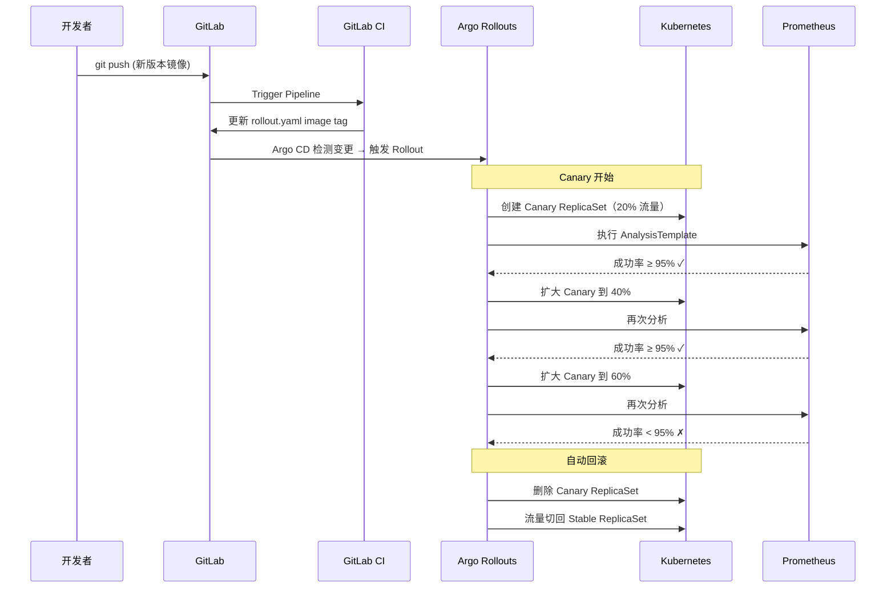

# Stage 3: Canary 金丝雀发布

## 流程概览



---

## 一、前置条件

| 项目 | 要求 | 验证命令 |
|------|------|----------|
| Stage 2 完成 | dev/staging/prod 已部署 | `argocd app list \| grep stage2` |
| Argo Rollouts | Controller 已安装 | `kubectl get pods -n argo-rollouts` |
| Argo Rollouts CLI | 已安装 kubectl 插件 | `kubectl argo rollouts version` |
| Prometheus（可选） | 已部署 | `kubectl get pods -n monitoring` |

### 安装 Argo Rollouts CLI

```bash
# 安装 kubectl argo-rollouts 插件
curl -LO https://github.com/argoproj/argo-rollouts/releases/latest/download/kubectl-argo-rollouts-linux-amd64
chmod +x ./kubectl-argo-rollouts-linux-amd64
sudo mv ./kubectl-argo-rollouts-linux-amd64 /usr/local/bin/kubectl-argo-rollouts

# 验证
kubectl argo rollouts version
```

---

## 二、操作步骤

### Step 1: 推送 Stage 3 代码

```bash
cd /path/to/cicd-demo

# 复制 stage3 目录
cp -r /path/to/cicd_easy/stage3-canary/ .

# 推送到 GitLab
git add .
git commit -m "feat: add stage3 canary deployment"
git push origin main
```

### Step 2: 创建 Argo CD Application

```bash
kubectl apply -f stage3-canary/k8s/argocd-app.yaml

# 验证
argocd app get stage3-canary
```

### Step 3: 观察 Rollout 初始部署

```bash
# 初始部署会创建 4 个稳定版本 Pod
kubectl argo rollouts get rollout stage3-app

# 查看 Pod
kubectl get pods -l app=stage3-app
# 预期: 4 个 Running Pod（稳定版本）
```

### Step 4: 触发 Canary 更新

```bash
# 修改 index.html 模拟新版本
sed -i 's/Version: v1.0.0/Version: v2.0.0/' stage3-canary/index.html
sed -i 's/#f093fb 0%, #f5576c 100%/#667eea 0%, #764ba2 100%/' stage3-canary/index.html

# 推送变更触发 Canary
git add .
git commit -m "feat: stage3 v2.0.0 canary release"
git push origin main

# 实时观察 Canary 进度
kubectl argo rollouts get rollout stage3-app --watch
```

### Step 5: 观察渐进式发布

```bash
# 在另一个终端，持续观察 Rollout 状态
watch -n 2 'kubectl argo rollouts get rollout stage3-app'

# 预期输出:
# Name:            stage3-app
# Namespace:       default
# Status:          Progressing
# Strategy:        Canary
#   Step:          2/8
#   SetWeight:     20
#   ActualWeight:  20
# Images:          gitlab.local:5050/root/cicd-demo/stage3:abc1234 (canary)
#                  gitlab.local:5050/root/cicd-demo/stage3:latest   (stable)
```

### Step 6: 模拟自动回滚

```bash
# 方法 1: 修改 AnalysisTemplate 的 successCondition 为不可能达成的条件
# 让分析失败，触发自动回滚
kubectl patch analysistemplate success-rate --type merge -p '
  spec:
    metrics:
      - name: success-rate
        successCondition: result[0] >= 0.9999
        provider:
          prometheus:
            query: "1"
'

# 然后触发一次新的更新
sed -i 's/Version: v2.0.0/Version: v2.0.1-broken/' stage3-canary/index.html
git add . && git commit -m "feat: broken version for rollback test" && git push

# 观察 Argo Rollouts 自动回滚
kubectl argo rollouts get rollout stage3-app --watch
# 预期: Canary → Aborted → 回滚到稳定版本
```

### Step 7: 手动 Promote / Abort

```bash
# 手动推进到下一步（跳过 pause）
kubectl argo rollouts promote stage3-app

# 手动中止 Canary（立即回滚）
kubectl argo rollouts abort stage3-app

# 重试最近一次 Rollout
kubectl argo rollouts retry stage3-app
```

---

## 三、预期结果

| 阶段 | 流量分配 | Pod 分布 | 状态 |
|------|----------|----------|------|
| 初始 | stable: 100% | 4 stable | Healthy |
| Step 1 (20%) | stable: 80%, canary: 20% | 3 stable + 1 canary | Progressing |
| Step 2 (40%) | stable: 60%, canary: 40% | 2 stable + 2 canary | Progressing |
| Step 3 (60%) | stable: 40%, canary: 60% | 2 stable + 3 canary | Progressing |
| Step 4 (100%) | canary: 100% | 4 canary | Promoting |
| 完成 | stable: 100% | 4 stable (新版本) | Healthy |
| 回滚 | stable: 100% | 4 stable (旧版本) | Degraded → Healthy |

---

## 四、验证命令

```bash
# 1. 查看 Rollout 状态
kubectl argo rollouts get rollout stage3-app

# 2. 查看 ReplicaSet 分布
kubectl get rs -l app=stage3-app

# 3. 查看 Canary 和 Stable Service Endpoints
kubectl get endpoints stage3-canary
kubectl get endpoints stage3-stable

# 4. 查看 AnalysisRun 状态
kubectl get analysisrun -l app=stage3-app

# 5. 查看 Rollout 事件
kubectl describe rollout stage3-app

# 6. Argo Rollouts Dashboard（可选 UI）
kubectl port-forward -n argo-rollouts svc/argo-rollouts-dashboard 3100:3100
# 浏览器访问: http://localhost:3100

# 7. 验证流量切换
# 在 Canary 进行中时访问服务
kubectl port-forward svc/stage3-stable 8080:80 &
kubectl port-forward svc/stage3-canary 8081:80 &

# 多次请求 stable 观察响应
for i in $(seq 1 20); do curl -s http://localhost:8080 | grep Version; done
```

---

## Argo Rollouts vs Kubernetes Deployment 对比

| 维度 | Deployment | Rollout |
|------|-----------|---------|
| 更新策略 | RollingUpdate / Recreate | Canary / Blue-Green |
| 流量控制 | 无（全部切换） | 按比例渐进切换 |
| 健康检查 | 仅 readinessProbe | 自定义 AnalysisTemplate |
| 自动回滚 | 仅 Pod 级别 | 基于业务指标回滚 |
| 暂停/恢复 | 手动 pause | 内置 pause 步骤 |
| 可观测性 | kubectl rollout status | kubectl argo rollouts get |

---

## 常见问题排查

| 问题 | 原因 | 解决方法 |
|------|------|----------|
| Rollout 不创建 Canary Pod | Rollout CRD 未安装 | `kubectl apply -k github.com/argoproj/argo-rollouts/manifests/crds` |
| AnalysisRun 失败 | Prometheus 不可达 | 使用 web-check 替代模板 |
| 流量未正确切换 | Service selector 不匹配 | 检查 canaryService/stableService 配置 |
| 回滚后仍显示 Degraded | Pod 需要 Ready | 等待 readinessProbe 通过 |
| Argo CD 显示 OutOfSync | AnalysisTemplate 变更 | 手动 Sync 或等待自动同步 |
