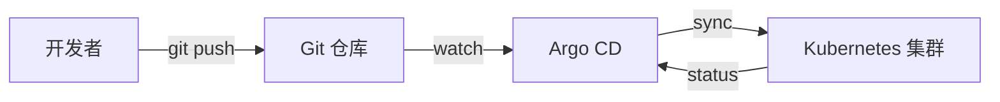

# Stage 1: GitOps 基本闭环

import Quiz from '@site/src/components/Quiz';

## 什么是 GitOps？

GitOps 是一种现代化的持续交付方法，其核心思想是 **将 Git 作为基础设施和应用配置的唯一可信源**。

### 四大原则

1. **声明式配置** — 整个系统的期望状态用声明式语言描述（如 YAML），而不是命令式脚本
2. **Git 单一可信源** — 系统的期望状态存储在 Git 中，所有变更通过 Git 提交
3. **自动同步** — 控制器持续比对 Git 中的期望状态与集群的实际状态，自动拉取变更
4. **持续协调** — 任何偏差都会被自动修正，确保系统始终处于期望状态

## Stage 1 学习目标

在本阶段，你将理解并实践：

- Docker 镜像构建（Kaniko）
- GitLab CI Pipeline 配置（`.gitlab-ci.yml`）
- Argo CD Application 定义与同步
- Git Push → CI Build → CD Sync 完整闭环

## Stage 1 知识检测

<Quiz
  title="Stage 1: GitOps 基础"
  questions={[
    {
      question: "GitOps 的核心思想是什么？",
      options: [
        "使用 Web UI 管理基础设施",
        "将 Git 作为基础设施和应用配置的唯一可信源",
        "用脚本自动化所有操作",
        "手动登录服务器部署应用"
      ],
      correctIndex: 1,
      explanation: "GitOps 的核心是将 Git 仓库作为系统期望状态（desired state）的唯一可信源（single source of truth），所有变更通过 Git 提交触发。"
    },
    {
      question: "Argo CD 在 GitOps 中扮演什么角色？",
      options: [
        "代码编译工具",
        "持续交付控制器，监控 Git 变更并同步到集群",
        "容器镜像仓库",
        "代码质量分析工具"
      ],
      correctIndex: 1,
      explanation: "Argo CD 是 Kubernetes 原生的持续交付工具，它持续监控 Git 仓库中的声明式配置，自动将变更同步到集群。"
    },
    {
      question: "$CI_COMMIT_SHORT_SHA 变量的含义是什么？",
      options: [
        "CI Pipeline 的 ID",
        "Git 提交的完整哈希值",
        "Git 提交的短哈希值，通常用作镜像标签",
        "分支名称"
      ],
      correctIndex: 2,
      explanation: "$CI_COMMIT_SHORT_SHA 是 GitLab CI 的内置变量，包含 Git 提交的短哈希值（前 8 位），常被用作容器镜像标签以关联代码版本。"
    },
    {
      question: "Kaniko 相比 Docker build 的主要优势是什么？",
      options: [
        "构建速度更快",
        "不需要 Docker daemon 即可在 Kubernetes 内构建镜像",
        "生成的镜像更小",
        "支持更多编程语言"
      ],
      correctIndex: 1,
      explanation: "Kaniko 的核心优势是可以在没有 Docker daemon 的环境中（如 Kubernetes Pod 内）构建容器镜像，这在安全受限的 CI 环境中特别有用。"
    }
  ]}
/>

下一步: [Pipeline 配置](./pipeline-config)
