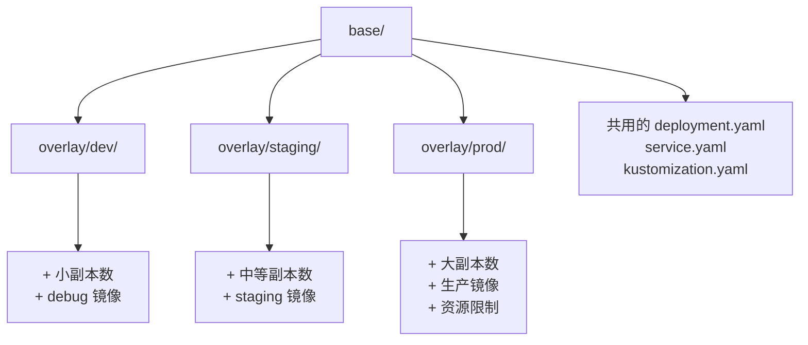

# Stage 2: 多环境管理

## 为什么需要多环境？

在真实的 CI/CD 流程中，应用需要部署到多个环境：

| 环境 | 用途 | 特点 |
|------|------|------|
| **dev** | 开发测试 | 快速迭代，资源少 |
| **staging** | 预发布验证 | 接近生产配置 |
| **prod** | 生产环境 | 高可用，严格变更控制 |

## Kustomize base/overlay 架构

### 核心思想

- **base/** — 所有环境共享的基础配置
- **overlay/** — 每个环境的差异化配置，只写与 base 不同的部分

## Stage 2 学习目标

- [ ] 理解 Kustomize base/overlay 架构
- [ ] 掌握多环境差异化配置方法
- [ ] 配置 Argo CD 多 Application 管理
- [ ] 理解 Sync Policy 对不同环境的影响

下一步: [Kustomize 配置](./kustomize-config)
