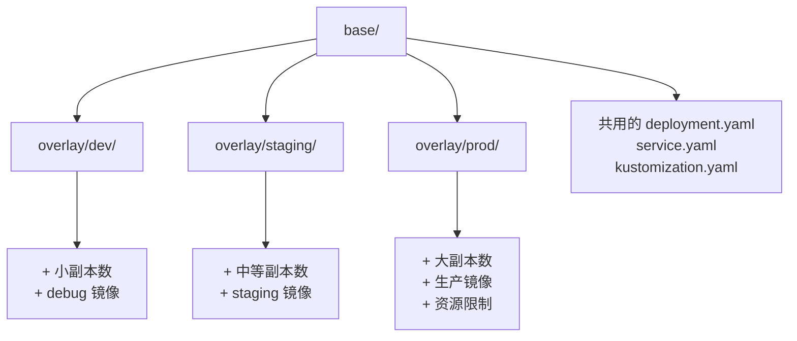

# Stage 2: 多环境管理

import Quiz from '@site/src/components/Quiz';

## 为什么需要多环境？

在真实的 CI/CD 流程中，应用需要部署到多个环境：

| 环境 | 用途 | 特点 |
|------|------|------|
| **dev** | 开发测试 | 快速迭代，资源少 |
| **staging** | 预发布验证 | 接近生产配置 |
| **prod** | 生产环境 | 高可用，严格变更控制 |

## Kustomize base/overlay 架构

### 核心思想

- **base/** — 所有环境共享的基础配置
- **overlay/** — 每个环境的差异化配置，只写与 base 不同的部分

## Stage 2 学习目标

- [ ] 理解 Kustomize base/overlay 架构
- [ ] 掌握多环境差异化配置方法
- [ ] 配置 Argo CD 多 Application 管理
- [ ] 理解 Sync Policy 对不同环境的影响

## Stage 2 知识检测

<Quiz
  title="Stage 2: 多环境管理"
  questions={[
    {
      question: "Kustomize 中 base/ 和 overlay/ 的关系是什么？",
      options: [
        "base 是生产配置，overlay 是测试配置",
        "base 包含共享配置，overlay 只写与 base 不同的部分",
        "base 和 overlay 是独立的配置，互不影响",
        "overlay 替换 base 中的所有配置"
      ],
      correctIndex: 1,
      explanation: "Kustomize 的核心理念是 DRY（Don't Repeat Yourself）。base/ 包含所有环境共享的基础配置，overlay/ 只定义与 base 不同的差异化部分。"
    },
    {
      question: "生产环境(prod)通常使用哪种 Sync Policy？",
      options: [
        "Auto Sync - 自动同步所有变更",
        "Manual Sync - 需要人工审批后才同步",
        "不需要 Sync Policy",
        "随机选择"
      ],
      correctIndex: 1,
      explanation: "生产环境通常使用手动同步，确保每次变更都经过人工审核。开发环境则可以用自动同步来加快迭代速度。"
    },
    {
      question: "kustomization.yaml 中 resources 字段的作用是什么？",
      options: [
        "定义 CPU/内存资源限制",
        "列出要包含的 K8s 资源文件",
        "配置 Git 仓库地址",
        "定义环境变量"
      ],
      correctIndex: 1,
      explanation: "resources 字段列出此 Kustomization 需要处理的 K8s 资源文件（YAML）。overlay 中通常用 '../../base' 引用基础配置。"
    }
  ]}
/>

下一步: [Kustomize 配置](./kustomize-config)
