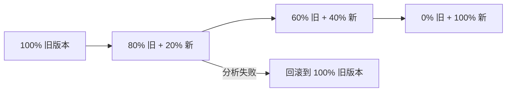

# Stage 3: Canary 金丝雀发布

## 什么是金丝雀发布？

金丝雀发布是一种**渐进式交付**策略：先向一小部分用户暴露新版本，观察指标正常后逐步扩大范围。

### 与滚动更新的区别

| 特性 | 滚动更新 | 金丝雀发布 |
|------|----------|-----------|
| 发布速度 | 逐步替换 | 可暂停/继续 |
| 流量控制 | 自动均分 | 精确百分比 |
| 自动分析 | 无 | 有（AnalysisTemplate） |
| 回滚能力 | 手动 | 自动 |

## Argo Rollouts 核心概念

- **Rollout** — 替代 Deployment 的工作负载资源，定义发布策略
- **Canary Strategy** — 金丝雀发布策略，配置步骤和流量分配
- **AnalysisTemplate** — 定义分析指标和成功/失败条件
- **AnalysisRun** — 发布过程中执行的分析实例

## Stage 3 学习目标

- [ ] 理解 Canary 发布原理和适用场景
- [ ] 配置 Argo Rollouts 发布策略
- [ ] 设计 AnalysisTemplate 指标分析
- [ ] 掌握自动回滚机制

下一步: [Rollout 配置](./rollout-config)
